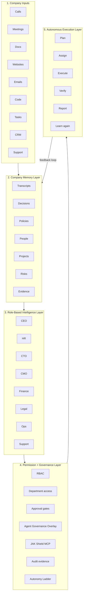

# JAK Swarm — Long-Term Vision & Roadmap

> **This is a future roadmap, not a shipped-product claim.** Every "evolving toward" item describes direction. Every "shipped" item links to code you can verify today. If a row says "not yet built" or "evolving," that is the honest status.

---

## Product Sentence

JAK Swarm is the ever-learning Company OS. JAK Shield is the MCP-native trust gateway that protects every real-world agent action.

---

## The 5-Layer Model

---

## Time Horizons

### Short Term — Company Memory Layer

**What:** Transcripts, decisions, policies, people, projects, risks, and evidence extracted from existing connectors (Gmail, Slack, GitHub, Notion) into a persistent, queryable evidence graph.

**Foundation shipped:**

- [`company-operating-layer.service.ts`](apps/api/src/services/company-brain/company-operating-layer.service.ts) — artifact ingestion, entity extraction, drift detection, agent-executable spec generation
- [`company-profile.service.ts`](apps/api/src/services/company-brain/company-profile.service.ts) — LLM-extracted company profiles (industry, brand voice, competitors, goals) approved by the user
- `persistLearning` / `recallLearnings` — per-role memory keyed by tenant, injected into agent context via `<memory>` tags

**Evolving toward:**

- Full auto-sync from all connectors (currently manual ingestion + 7 artifact sources)
- Cross-session grounding (memory that persists and improves across workflows)
- Proactive drift detection (the system tells you what changed, not just answers when asked)

### Medium Term — Role-Based Intelligence + Permission Governance

**What:** Department-aware agent roles (CEO, HR, CTO, CMO, Finance, Legal, Ops, Support) with RBAC-scoped context, Ability Packs, Autonomy Ladder (L0–L4 with local policy; L5 deferred), Agent Governance Overlay enforcing agent profiles and memory scopes.

**Foundation shipped:**

- 38 specialist agents across Executive, Operations, Core, and Vibe Coding layers, each with domain-scoped prompts and tool allowlists
- 13 industry packs with agent prompt supplements, policy overlays, and restricted tool lists
- Local policy logic in `packages/security`: Agent Firewall, Risk-Based Approvals, Secure Tool Permissions, Sandboxed Execution, Defensive Vulnerability Triage, Audit Evidence Layer — **all 6 defenses are wired and enforced on every agent action today**
- JAK Shield is a separate MCP-native 10-stage security gateway ([github.com/inbharatai/jak-shield](https://github.com/inbharatai/jak-shield)) — the MCP call to this external service is Phase 11B; local policy enforcement is active now
- 5-role RBAC (`END_USER`, `REVIEWER`, `OPERATOR`, `TENANT_ADMIN`, `SYSTEM_ADMIN`)

**Evolving toward:**

- Department-scoped RBAC (HR agents see HR context only; Finance agents see Finance context only)
- Per-department approval policies (Finance actions require Finance REVIEWER; Legal actions require Legal REVIEWER)
- Agent Governance Overlay enforcing profiles, scopes, and role boundaries (Phase 1-11A: local policy; Phase 11B+: JAK Shield MCP integration)
- Ability Packs (department-scoped tool, memory, and approval configurations)
- Autonomy Ladder (L0 answer-only → L4 execute with approval; L5 autonomous loop deferred to Phase 11B+)

### Long Term — Autonomous Execution Layer

**What:** Plan, assign, execute, verify, report, learn again — a closed loop where approved work completes across the organisation and the system improves from each cycle.

**Foundation shipped:**

- Commander → Planner → Router → Worker → Verifier loop with auto-repair
- Risk-tiered approval gates with SHA-256 payload binding
- HMAC-signed audit evidence bundles
- Self-correction: `reflectAndCorrect()` + `RepairService` with 9 error categories

**Evolving toward:**

- Self-improving cycles (the system learns from completed workflows and adjusts future plans without human re-specification)
- Cross-workflow learning (insights from one department's work inform another)
- Proactive task assignment (the system identifies work that needs doing, rather than waiting for a prompt)

### JAK Shield MCP Integration Timeline

**Phase 1-11A:** All security enforcement uses local policy logic in `packages/security` — Agent Firewall, Risk-Based Approvals, Secure Tool Permissions, Sandboxed Execution, Defensive Vulnerability Triage, and Audit Evidence Layer are all wired and active. JAK Shield MCP exists as a separate 10-stage product at [github.com/inbharatai/jak-shield](https://github.com/inbharatai/jak-shield); the MCP call from JAK Swarm to that external service is not yet wired (Phase 11B).

**Phase 11B:** Wire JAK Shield MCP for high-risk action validation. Create `ShieldMcpClient` and wire `AgentGovernanceOverlay` to call JAK Shield MCP for high-risk actions. Shield MCP decisions stored in AuditLog with HMAC signatures.

**Phase 11B+:** JAK Shield MCP provides additional security layer for high-risk actions. If JAK Shield MCP unavailable, fall back to local policy + require approval.

---

## Honest Boundaries

This section explicitly states what the roadmap does **not** claim:

- **"Company OS" is a direction, not a shipped product.** The beta ships a closed-loop operating layer for product and engineering execution. The full Company OS vision requires auto-sync, department-scoped RBAC, and autonomous learning cycles that are not yet built.
- **Auto-sync is a product build item.** Full connector auto-sync (all inputs flowing automatically into the evidence graph) does not exist today. The `company-operating-layer.service.ts` pipeline exists for manual ingestion.
- **Department-scoped RBAC does not exist.** The current 5-role RBAC is tenant-scoped, not department-scoped. Adding department boundaries requires schema changes, migration, and UI work.
- **Self-improving cycles are not built.** Agent memory (`persistLearning` / `recallLearnings`) persists facts across workflows. It does not yet adjust future plans without human re-specification.
- **Agent Governance Overlay is not built.** The current Guardrail agent is a stateless in-process policy checker. The Agent Governance Overlay (agent profiles, memory scopes, autonomy boundaries, calling JAK Shield MCP for signed decisions) is a roadmap item. See [`docs/EVOLUTION-PLAN.md`](EVOLUTION-PLAN.md) for the phased implementation plan.
- **JAK Shield MCP integration is not yet wired.** JAK Shield is a separate 10-stage MCP-native gateway at [github.com/inbharatai/jak-shield](https://github.com/inbharatai/jak-shield). The `ShieldMcpClient` and `Agent Governance Overlay` that will call it are Phase 11B of the evolution plan. **Today, JAK Swarm's 6 local policy defenses in `packages/security` are fully wired and enforced on every agent action** — what is NOT wired is the MCP call to the external JAK Shield service for signed high-risk decisions.
- **Ability Packs and Autonomy Ladder are not built.** Department-scoped tool configurations and agent autonomy levels (L0–L5) are roadmap items.
- **Third-party SOC 2 / HIPAA / ISO 27001 attestation has not happened.** The infrastructure is shipped (182 controls, 108 operationally backed). The certification audit has not.

These boundaries mirror the "Honest boundary" subsection in the README and the "What Is Not Yet Enterprise-Ready" section in [`docs/beta-release.md`](beta-release.md).

---

## Related Documentation

- [`ARCHITECTURE.md`](../ARCHITECTURE.md) — system architecture and data model
- [`docs/beta-release.md`](beta-release.md) — beta scope and go/no-go checklist
- [`docs/competitive-positioning.md`](competitive-positioning.md) — market positioning
- [`docs/jak-shield-manifest.md`](jak-shield-manifest.md) — Local policy defenses (JAK Shield is a separate 10-stage MCP gateway at [github.com/inbharatai/jak-shield](https://github.com/inbharatai/jak-shield))
- [`docs/EVOLUTION-PLAN.md`](EVOLUTION-PLAN.md) — Full next-evolution architecture including JAK Shield MCP integration and Agent Governance Overlay