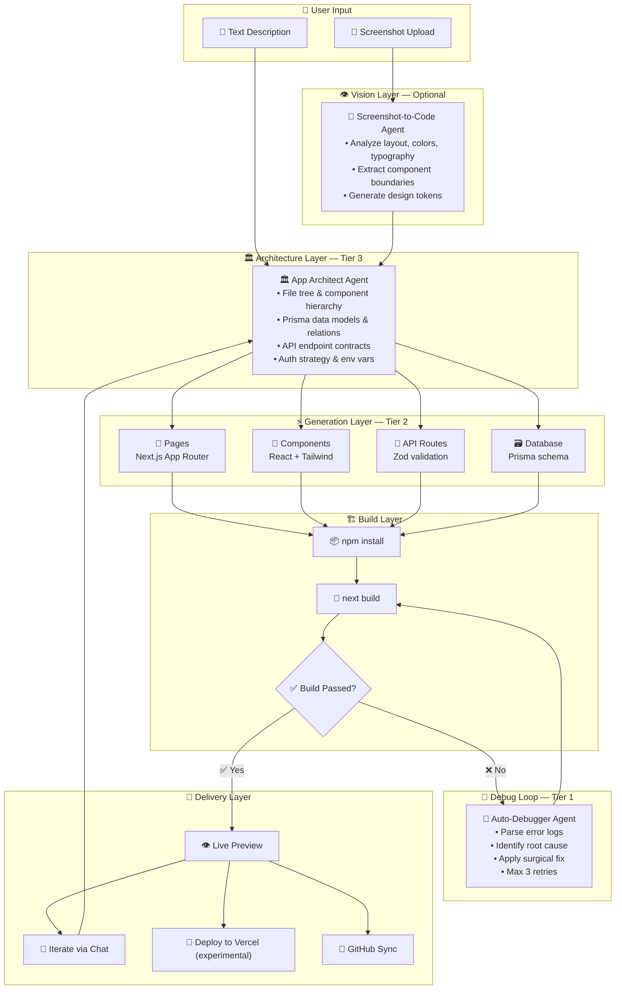

# ⚡ Vibe Coding — AI App Builder

**Describe an app in plain English. Watch 5 AI agents architect, generate, debug, and deploy it — as a single durable workflow with auto-repair and diff-aware checkpoints.**

*Think Emergent.sh / Lovable / Bolt.new, but with operator-grade durability — cross-instance reclaim, risk-stratified approvals, structural diff on every stage, diff-aware revert to any checkpoint.*

---

## What Makes This Different

- **Durable workflow**, not chat: the Vibe Coder chain runs through the queue with `workflowKind: 'vibe-coder'`. A worker can die mid-run and another instance reclaims the job.
- **3-layer build verification**: heuristic checker catches truncation + placeholder leaks in ~1ms → TypeScript compiler API catches real syntax/type errors in-memory in sub-second → optional Docker-backed `next build` provides the real production pre-flight. Each layer fails fast and passes the earliest actionable error to the debugger.
- **Auto-repair loop**: up to 3 debug retries per workflow, with fingerprint-based loop detection to stop the same fix from being tried repeatedly.
- **Checkpoint-revert**: every stage (generator, debugger-retry N, deployer) auto-snapshots the project with a structural diff (+added ~modified -deleted) persisted to `project_versions.diffJson`. Restore creates a new rollback version — restores are themselves reversible.
- **Subscription-tier gating**: free-tier runs route through the lower-cost GPT-5.4 tier; paid routes unlock Tier 3 GPT-5.5 for the Architect / Technical / Strategist stages.

---

## Pipeline Architecture

---

## Builder IDE

The Vibe Coding IDE includes:

- **Monaco editor** with syntax highlighting, autocomplete, and multi-file editing
- **File tree** with project structure navigation
- **Chat panel** for natural-language iteration ("Add dark mode", "Change the sidebar layout")
- **Live preview** via iframe with hot reload
- **Version history** with structural diffs and one-click restore
- **Deploy button** for Vercel deployment (experimental — requires Vercel API token)

---

## Feature Comparison

| Feature | JAK Swarm | Emergent.sh | Lovable | Bolt.new |
|:--------|:---------:|:-----------:|:-------:|:--------:|
| Full-stack generation | ✅ | ✅ | ✅ | ✅ |
| Multi-agent pipeline | ✅ 5 agents | ✅ | ❌ | ❌ |
| Screenshot-to-code | ✅ | ✅ | ❌ | ❌ |
| Self-debugging loop | ✅ 3 retries | ✅ | ❌ | ❌ |
| 3-tier cost routing | ✅ | ❌ | ❌ | ❌ |
| Version rollback | ✅ | ✅ | ✅ | ❌ |
| Monaco editor | ✅ | ❌ | ✅ | ✅ |
| Vercel deploy | 🚧 Planned | ❌ Custom | ✅ | ✅ |
| GitHub sync | ✅ | ✅ | ✅ | ✅ |
| Open source | ✅ MIT | ❌ | ❌ | ❌ |
| 122 classified tools (CI-enforced) | ✅ | ❌ | ❌ | ❌ |
| Voice input | ✅ | ❌ | ❌ | ❌ |
| Multi-tenant SaaS | ✅ | ❌ | ❌ | ❌ |
| Industry compliance | ✅ 13 packs | ❌ | ❌ | ❌ |

---

## Cost Per App

| Stage | OpenAI Tier | OpenAI Model | Gemini Tier | Gemini Model | Est. Cost |
|:------|:----------:|:------------:|:-----------:|:------------:|:---------:|
| 📸 Screenshot analysis | Tier 3 | GPT-5.5 | Tier 3 | Gemini 2.5 Pro | $0.10-0.20 |
| 🏛️ Architecture | Tier 3 | GPT-5.5 | Tier 3 | Gemini 2.5 Pro | $0.20-0.50 |
| ⚡ Code generation | Tier 2 | GPT-5.4 | Tier 2 | Gemini 2.5 Flash | $0.15-0.40 |
| 🔧 Debug iterations | Tier 1 | GPT-5.4 mini | Tier 1 | Gemini 2.5 Flash-Lite | $0.02-0.05/iter |
| 🚀 Deploy | Tier 1 | Tool calls only | Tier 1 | Tool calls only | $0.01-0.02 |
| | | **Total (new app)** | | | **$0.50-2.00** |
| | | **Per iteration** | | | **$0.05-0.30** |

*Estimated costs based on model pricing. Actual costs vary by app complexity, model selection, and debug iterations.*

---

## Templates

| Template | Stack | Includes |
|:---------|:------|:---------|
| `nextjs-app` | Next.js 14 + Tailwind | App Router, TypeScript strict, responsive layout |
| `nextjs-saas` | Next.js 14 + Prisma + Stripe | Auth, database, payments, dashboard scaffold |
| `react-spa` | React + Vite + Router | Single-page app, client-side routing, Tailwind |